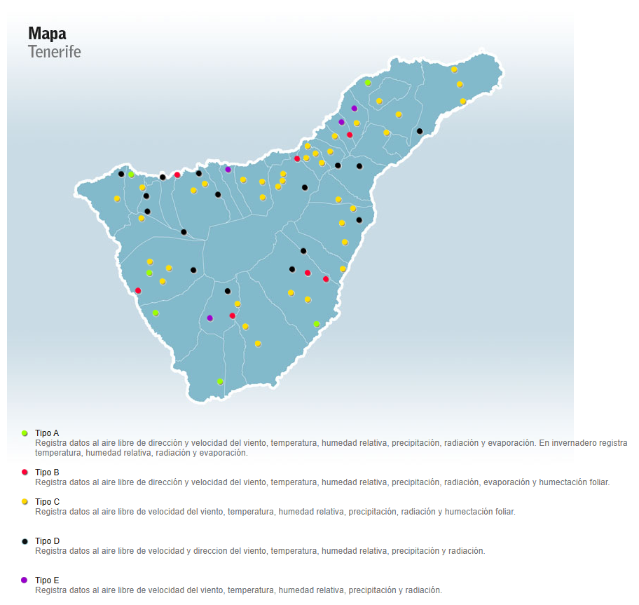

# Datos-meteorologicos-diarios-de-Tenerife-Ecomuseo-
Análisis de los datos meteorológicos diarios de Tenerife recogidos en la estación Ecomuseo.
 
Este set de datos proviene del catálogo de datos abiertos compartidos por el Gobierno de España.
https://datos.gob.es/es/catalogo/l03380011-datos-meteorologicos-diarios-de-tenerife-para-la-estacion-ecomuseo
 

Luego tambhién haremos un estudio de los datos de todas las estaciones que nos proporciona el Cabildo Insular de Tenerife y compararemos los datos entre estaciones.
 
https://datos.gob.es/es/catalogo/conjuntos-datos?publisher_display_name=Cabildo+Insular+de+Tenerife

